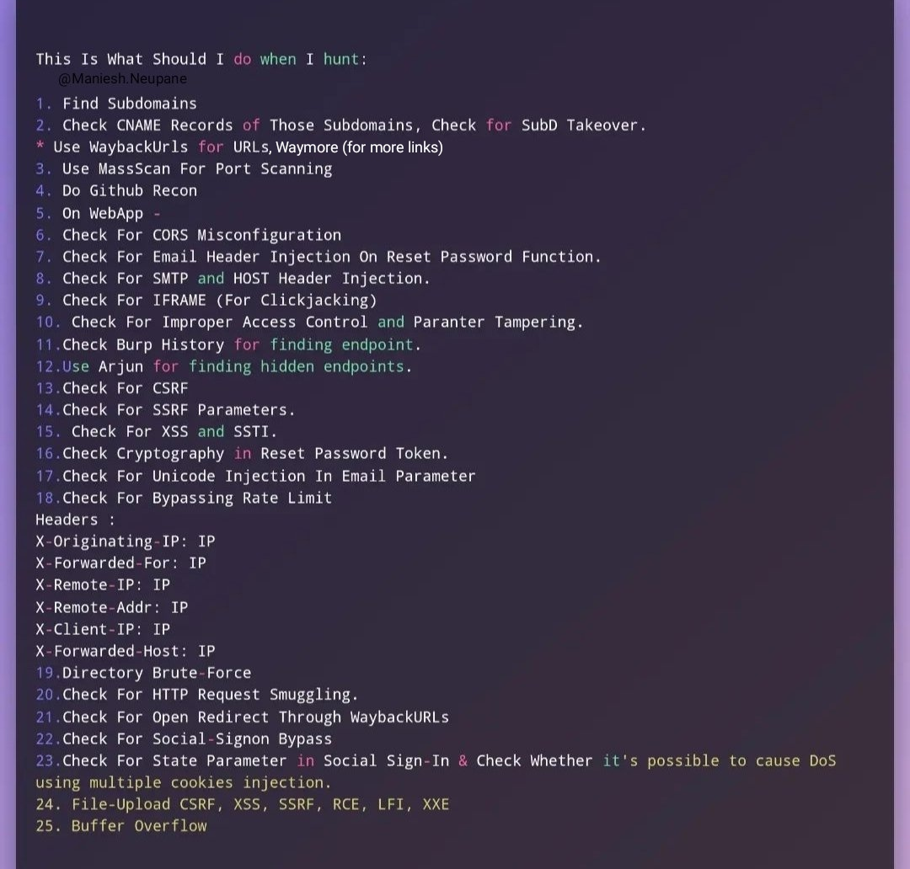
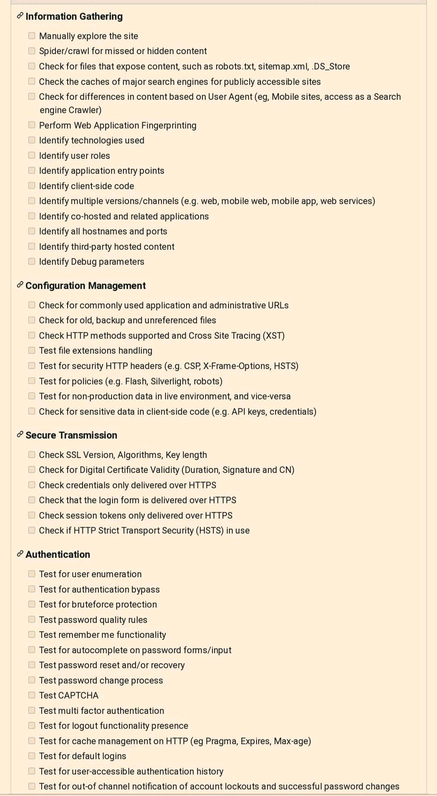
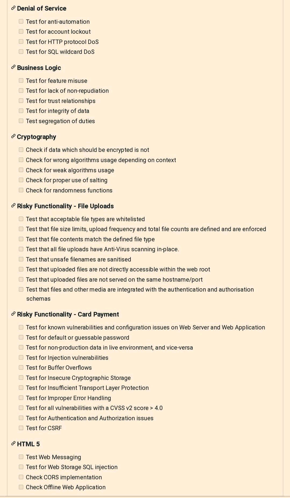

# BugBounty-Recon-Methodology
Bug Bounty Recon Methodology

## 🏗 Phase 1: Passive Intelligence & Scope Mapping

Identify the organization's global footprint, network boundaries, and historical data.

### 1.1 ASN & Network Mapping

```bash
# Get ASN and convert to IP ranges
asnmap -d target.com | dnsx -silent > asn.txt

# Whois lookup for IP ranges
whois -h whois.radb.net -- '-i origin AS714' | grep -Eo "([0-9.]+){4}/[0-9]+" | uniq | mapcidr -silent | httpx > cidr_ips.txt

# Extract IPs from 3rd party providers
curl -s "https://urlscan.io/api/v1/search/?q=domain:target.com&size=10000" | jq -r '.results[]?.page?.ip//empty' | grep -Eo '([0-9]{1,3}\.){3}[0-9]{1,3}' | tee urlscan_ips.txt
curl -s "https://www.virustotal.com/vtapi/v2/domain/report?domain=target.com&apikey=[key]" | jq -r '..|.ip_address?//empty' | grep -Eo '([0-9]{1,3}\.){3}[0-9]{1,3}' | tee vt_ips.txt
curl -s 'https://subdomainfinder.c99.nl/scans/2025-12-29/target.com' | grep -Eo '([0-9]{1,3}\.){3}[0-9]{1,3}' | sort -u > c99_ips.txt

```

### 1.2 Passive Subdomain Scraping

```bash
subfinder -d target.com -all -recursive -o sub1.txt
findomain -t target.com | tee sub2.txt
amass enum -passive -d target.com -norecursive -noalts -o sub3.txt
Subenum -d target.com | tee sub4.txt
Chaos -d target.com | tee sub5.txt
github-subdomain -d target.com | tee sub6.txt
assetfinder --subs-only target.com > sub7.txt
echo "target.com" | subdog | tee sub8.txt
tldfinder -d target.com | tee sub9.txt
bbot -t target.com -f subdomain-enum | tee sub10.txt
oneforall --target target.com --brute False run | tee sub11.txt

# Certificate & API Scraping
curl -s "https://crt.sh/?q=%25.target.com&output=json" | jq -r '.[].name_value' | sed 's/\*\.//g' | sort -u > crtsh_subs.txt
curl -s -H "APIKEY: <KEY>" "https://api.securitytrails.com/v1/domain/target.com/subdomains" | jq -r '.subdomains[] | "\(.).target.com"' > securitytrails.txt

```

---

## 🧬 Phase 2: DNS Resolution & Brute-Forcing

Validating gathered data and uncovering hidden assets through permutations.

### 2.1 Filtering & Resolving

```bash
# Merge and unique all subdomains
cat sub*.txt crtsh_subs.txt securitytrails.txt | anew allsubs.txt

# Resolve with Puredns
cat allsubs.txt | puredns resolve -r resolvers.txt -w resolved.txt

# Secondary targeted Subfinder scan
subfinder -dL resolved.txt -all -recursive -o subfinder_recursive.txt

```

### 2.2 Brute-Force & Permutations

```bash
# Subdomain Brute-force
puredns bruteforce wordlist.txt target.com -r resolvers.txt -w brute_results.txt

# Permutation Scanning (AlterX)
cat resolved.txt | alterx | dnsx -silent | anew resolved.txt

```

---

## 📡 Phase 3: Infrastructure & Port Analysis

Mapping services and identifying misconfigured Virtual Hosts.

### 3.1 Port Scanning (Naabu & Nmap)

```bash
# Full Port Scan (excluding standard web ports for speed)
naabu -list resolved.txt -p - -exclude-ports 80,443 -o allports.txt

# Service Detection on discovered ports
nmap -sV -sC -iL allports.txt -oN nmap_details.txt

# Targeted Naabu/Nmap automated combo
naabu -list resolved.txt -c 50 -nmap-cli 'nmap -sV -sC' -o naabu_full.txt
naabu -list subs.txt -top-ports 1000 -exclude-ports 80,443,21,22,25 -o top1000ports.txt
naabu -list subs.txt -p - -exclude-ports 80,443,21,22,25 -o allports.txt


```

### 3.2 VHost & Subdomain Fuzzing

```bash
# VHost discovery using FFUF
ffuf -H 'Host: FUZZ.target.com' -u 'http://target.com' -w subdomains.txt -fs [size]

# API Fuzzing
ffuf -u https://FUZZ.api.target.com -w wordlist.txt
ffuf -u https://api.FUZZ.target.com -w wordlist.txt

```

---

## 🔍 Phase 4: Web Probing & Vulnerability Scanning

Detailed analysis of web-facing applications.

### 4.1 Web Discovery (HTTPX)

```bash
httpx -list allsubs.txt -status-code -content-length -content-type -line-count -title -body-preview -server -tech-detect -probe-all-ips -include-response -follow-host-redirects -random-agent -o httpx_full.txt

```

### 4.2 Nuclei & Takeover Checks

```bash
# CVEs, Misconfigs, and Information Exposures
cat live_web.txt | nuclei -t cves/ -t exposures/ -t misconfiguration/ -severity critical,high,medium -o nuclei_results.txt

# Subdomain Takeover Check
subzy run --targets resolved.txt

```

---

## 📜 Phase 5: Deep Content & JavaScript Analysis

Mining JavaScript and archives for hidden secrets and sensitive files.

### 5.1 URL & File Extraction

```bash
waymore -i target.com -mode U -oU urls.txt
katana -u target.com -kf robotstxt,sitemapxml -o katana_urls.txt

# Extract sensitive files (Docs, DBs, Backups)
cat urls.txt | grep -E "\.xls|\.xml|\.xlsx|\.json|\.pdf|\.sql|\.doc|\.zip|\.bak|\.config|\.yaml" | tee sensitive_files.txt

```

### 5.2 JavaScript Deep Dive

```bash
# Discover JS files
cat urls.txt | grep "\.js$" | httpx -mc 200 > js_files.txt
cat resolved.txt | getJS --complete | anew js_files.txt

# Extract Endpoints from JS files
cat js_files.txt | while read url; do curl -s $url | grep -aoP "(?<=(\"|\'|\`))\/[a-zA-Z0-9_?&=\/\-\#\.]*(?=(\"|\'|\`))"; done | sort -u > endpoints.txt

```

---

## ⚡ Phase 6: Input & Parameter Fuzzing

Automated vulnerability testing for injection and path traversal.

### 6.1 Parameter Discovery

```bash
arjun -i live_web.txt -m GET -oT params.txt

```

### 6.2 Vulnerability Automation (XSS/LFI)

```bash
# LFI Testing
cat live_web.txt | gf lfi | qsreplace "FUZZ" | while read url; do ffuf -u $url -w lfi_payloads.txt -mr "root:"; done

# XSS Testing
cat urls.txt | gf xss | uro | Gxss -p Rxss | dalfox pipe

```

### 6.3 Content Discovery (Directories)

```bash
ffuf -u https://target.com/FUZZ -w fuzz_wordlist.txt -mc 200,302
ffuf -u https://target.com/FUZZ.php -w words.txt -mc 200,302
ffuf -u https://target.com/FUZZ.zip -w words.txt -mc 200,302

```
---


---

## 📊 Visual Assets & Checklists


### 1. Methodology Overview


### 2. Advanced Attack Surface Mapping


### 3. Step-by-Step  Checklists
<p align="center">
  
  
</p>

For More Visit "https://www.pentest-book.com/others/web-checklist"
---
<p align="center">
  <b>Happy Hunting! 🚀</b>
</p>
